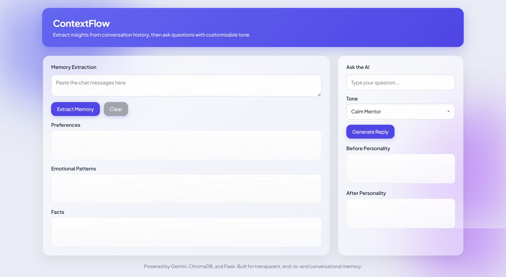
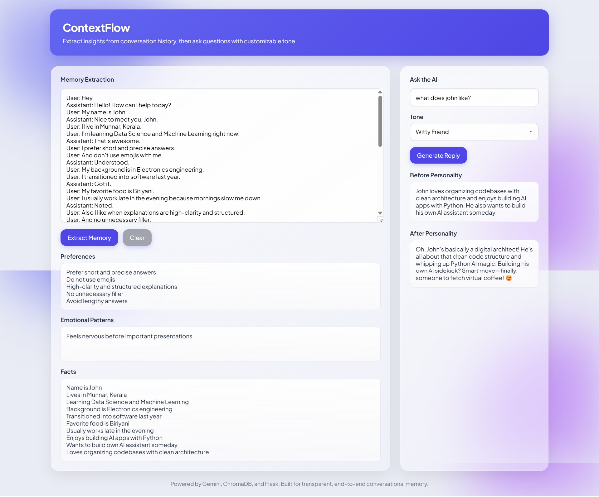

# ContextFlow  
## Extract insights from conversation history, then ask questions with customizable tone.
ContextFlow is built as a modular, fully transparent conversational intelligence stack.
The backend uses Flask and is cleanly separated into routing, memory processing, LLM interaction, and personality-rewriting modules.
Gemini Flash Lite handles both structured JSON extraction and raw natural-language generation, while a compact SQLite-based memory store keeps preferences, emotional patterns, and factual details persistent across requests.

The frontend is a lightweight, framework-free HTML + CSS + JavaScript single-page interface designed to clearly display each stage of the pipeline:
memory extraction, memory storage, contextual recall, raw model reasoning, and personality-style transformation.

---

## 📸 Interface Preview

### **Initial Interface**
Before any extraction or generation:


### **After Memory Extraction + Personality Response**
Full system behavior demonstrated:


---
```bash
                         ┌─────────────────────────┐
                         │       Frontend UI       │
                         │ HTML • CSS • Vanilla JS │
                         └────────────┬────────────┘
                                      │
                                      ▼
                         ┌─────────────────────────┐
                         │        Flask API        │
                         │  /memory   /personality │
                         └─────┬──────────┬────────┘
                               │          │
                 ┌─────────────┘          └──────────────┐
                 ▼                                       ▼
      ┌──────────────────────┐                ┌────────────────────────┐
      │  Memory Extraction   │                │   Personality Engine   │
      │    extractor.py      │                │       engine.py        │
      └─────────┬────────────┘                └──────────┬─────────────┘
                │                                        │
                ▼                                        ▼
     ┌──────────────────────┐                 ┌───────────────────────┐
     │   Gemini Flash Lite  │ <──────────────►│  Gemini Rewrite Call  │
     └─────────┬────────────┘                 └────────┬──────────────┘
               │                                       │
               │                              ┌────────┴──────────┐
               ▼                              ▼                   ▼
   ┌─────────────────────────┐      ┌────────────────┐ ┌─────────────────────┐
   │     SQLite Memory DB    │      │  Raw Response  │ │ Personality Output  │
   │   preferences/patterns  │      │    (before)    │ │       (after)       │
   │         + facts         │      └────────────────┘ └─────────────────────┘
   └─────────────────────────┘    
```
## 🧠 Overview

ContextFlow demonstrates a fully transparent conversational intelligence pipeline built with Flask, Gemini Flash Lite, SQLite, and a lightweight HTML/CSS/JS interface. The system highlights how memory extraction, retrieval, and tone-controlled generation can work together in a modular architecture.

### 1. Memory Extraction Engine

Users can paste up to 30 chat messages.
The backend analyzes them and extracts three categories:

- User Preferences
- Emotional Patterns
- Factual Information

All extracted items are stored in a single SQLite-backed memory database, optimized for fast retrieval and safe deployment on services like Render. The extraction process uses a strict, JSON-only Gemini prompt to guarantee clean, structured output.

### 2. Personality Transformation Engine

Any Gemini-generated response can be rewritten into one of five professional styles:

- Calm Mentor
- Witty Friend
- Therapist-Style
- Strict Analyst
- Professional Corporate Tone

Every transformed answer is constrained to six lines, providing clarity, consistency, and a polished conversational tone.

### 3. Transparent Single-Page UI

The interface exposes each layer of the pipeline:

- Memory extraction input
- Parsed preferences, patterns, and facts
- Raw LLM response
- Tone-transformed output

No hidden context, no silent memory. Every step is visible to the user.

---

## 📄 Example Conversation (DEMO)

A full 30-message fictional conversation demonstrating the extraction pipeline is included in:

### DEMO.md


This file shows exactly how the memory engine responds to real conversational structure.

---

## 🗂 Project Structure
```
ContextFlow/
│
├── backend/
│   ├── app.py                     # Main Flask app
│   ├── routes/
│   │   ├── memory_routes.py       # Extracts memories + stores them into SQLite memory DB
│   │   ├── personality_routes.py  # Generates raw Gemini replies + applies tone rewriting
│   │   └── healthcheck.py         # Simple "alive" endpoint used by Render health checks
│   ├── memory/
│   │   ├── extractor.py           # Prompts Gemini to extract structured JSON memories
│   │   └── storage.py             # SQLite storage + retrieval for preferences, patterns, facts
│   ├── personality/
│   │   └── engine.py              # Personality engine; rewrites answers into selected tone
│   ├── services/
│   │   ├── gemini_client.py       # Low-level Gemini API wrapper; handles requests + errors
│   │   └── utils.py               # Shared helper functions for formatting and safety checks
│   └── database/
│       └── memory.db              # Unified SQLite database storing all extracted memories
│
├── templates/
│   └── index.html                
│
├── DEMO.md                       
│
├── requirements.txt               
└── README.md                     
              

```

---


---

## ⚙️ Installation & Setup

### 1. Clone the repository
```bash
git clone https://github.com/AlenKJ01/ContextFlow.git
cd ContextFlow
```

### 2. Create virtual environment
```bash
python -m venv venv
venv\Scripts\activate         # Windows
source venv/bin/activate      # macOS/Linux
```

### 3. Install dependencies
```bash
pip install -r requirements.txt
```

### 4. Configure environment variables

Create a .env file:
```
GEMINI_API_KEY=your_key_here
GEMINI_MODEL=models/gemini-flash-lite-latest
```

### 5. Run the application
```bash
python backend/app.py
```

---

Access at:

### http://127.0.0.1:5000

---

## 🌐 Deployment (Render)

1. Push your project to GitHub.

2. Create a new Web Service on Render.

3. Configure:
```
Build Command: pip install -r requirements.txt
Start Command: python backend/app.py
```

4. Add environment variables:

- GEMINI_API_KEY
- GEMINI_MODEL=models/gemini-flash-lite-latest

5. Deploy.

---

## 💡 API Endpoints

### POST /memory/extract

Extract structured memory from conversation.

Input:
```
{
  "messages": ["Hi", "I prefer short answers", ...]
}
```

Output:
```
{
  "preferences": [...],
  "emotional_patterns": [...],
  "facts": [...]
}
```

### POST /personality/transform

Rewrite an answer into a specified tone.

Input:
```
{
  "text": "Explain gradient descent",
  "tone": "Strict Analyst"
}
```

Output:
```
{
  "before": "raw model answer",
  "after": "rewritten answer"
}
```
## 🧰 Tech Stack

- Flask

- SQLite

- Gemini Flash Lite

- HTML, CSS, Vanilla JS

- Python 3.10+


